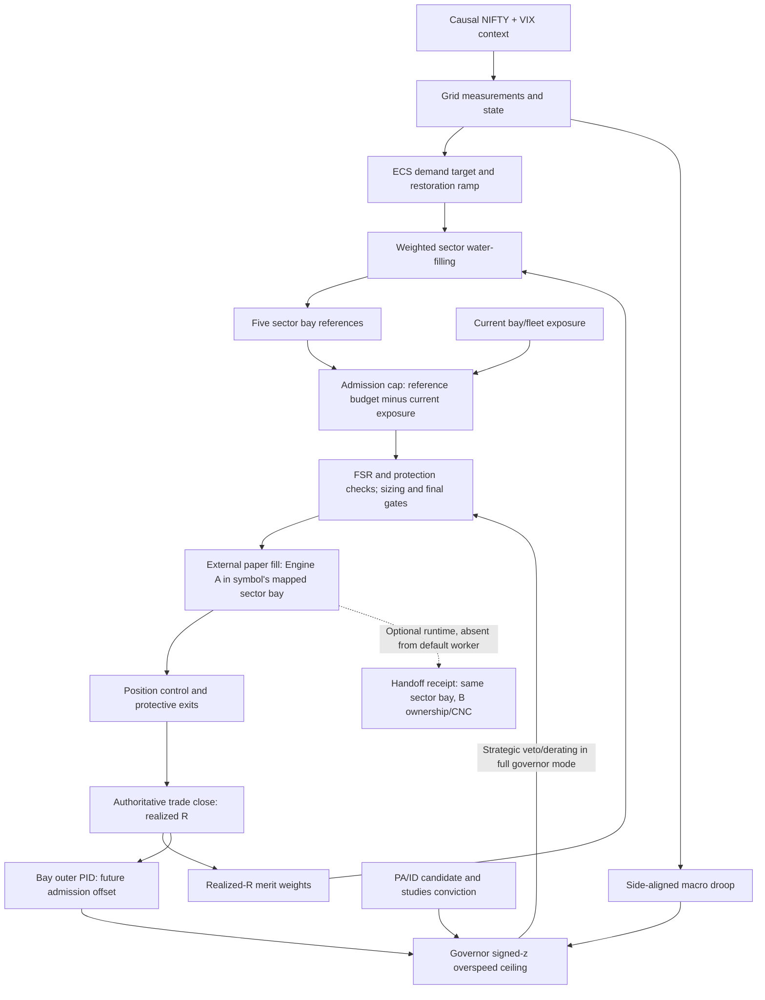

# Copied corrected source-audit diagram

Sector bay identity is independent of A/B ownership. Dashed handoff is optional and absent from the default candidate worker. Static source diagram is not execution evidence.
