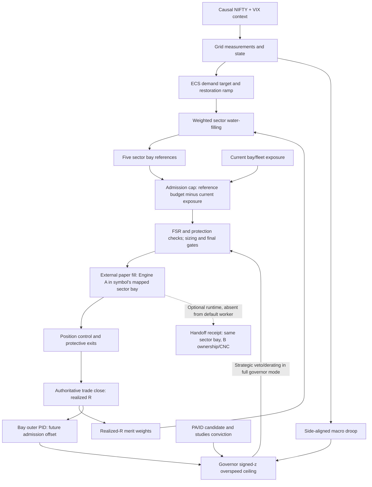

# Verification of the dispatch / ECS architecture note

The note is useful as a list of questions, but it is not a reliable description of the implemented R5 wiring. The main errors are conflating sector bays with Engine A/B ownership, conflating HRSG capital redistribution with product handoff, and treating a macro admission adjustment as a guaranteed BUY veto.

This report checks the current working-tree source against the frozen audit snapshot before extracting each block. Base commit: `411712afaecaeb44a6899a12db94ac547fef0186`. Modified/untracked integration code is included; this is not a claim that all excerpts are committed at that hash. No engine or parameter changes were made. Source reading is not execution proof. Excerpts are complete selected definitions, not standalone runnable programs.

## Corrected implementation diagram



Merit scoring is not an extra multiplier applied after sector dispatch. The weights are consumed inside water-filling. Neither macro input nor the HRSG ownership analogy supplies a missing continuous fleet PID. PAPER_APPLY and full governor authority are separate mode choices; an enabled plant cap does not establish full-governor strategic authority.

## Claim-by-claim check

| Note claim | Verdict | Actual source interpretation |
|---|---|---|
| R5 therefore includes every earlier implementation | Incorrect inference | Version identity does not prove import, instantiation, actuation, persistence or test coverage. Current loaded controllers and historical V3 implementations are different. |
| There are exactly five primary closed feedback loops | Unsupported inventory | The note mixes exogenous macro input, merit feedback, actual PID tracking, a lifecycle transition and a protective comparator. These are not five equivalent closed control loops. Count loops by measurement/reference/state/actuator and active mode. |
| GTG1 is Banking; GTG2 is Tech/Energy | Wrong canonical mapping | GTG1 is Heavy Industry/Metals/Energy/etc.; GTG2 is Tech/Telecom; Banking is CSTG1. TITAN is CSTG2 and RELIANCE is GTG1. |
| Every symbol belongs to a GTG; steam bays only receive handoffs | False | The canonical universe maps directly to all five sector bays. External admission looks up that mapping and can admit an A/intraday trade in a CSTG/BPSTG sector bay. Sector bay identity and Engine A/B ownership are independent dimensions. |
| HRSG is the trade ownership/MIS→CNC handoff | Conflation | revision5/hrsg.py reallocates bounded capital from unavailable GTG bays to healthy steam bays and reserves curtailed capital. HandoffManager and CombinedCycleRuntime implement optional ownership/product transitions. They do not implement a GTG-sector-to-STG-sector remapping. |
| A falling NIFTY automatically vetoes BUY; a rising NIFTY permits full size | False as a universal rule | Side-aligned adverse deviation lowers an overspeed ceiling. Rejection depends on signed stock z versus the resulting ceiling, plus FSR and other gates. Even zero droop does not establish ENTRY or full size. |
| ECS → sector allocation → separate merit multiplication | Wrong order | Merit weights are inputs to SectorDispatchController water-filling. PlantControlChain calls grid → ECS → weighted sector dispatch → governor references; governor cap subtracts current bay and fleet exposure. |
| FSR floor 0.25 is the exit threshold | Wrong control interpretation | minimum_value_gate reports max(floor,selected). position_decision exits using a separate configured fsr_exit_threshold plus inner hard safety, spread and persistence rules. Values must be read from the loaded frozen configuration, not assumed. |
| Exhaust spread trips/empties the entire bay | Overstated | A shared bay spread causes per-candidate entry HOLD or per-position EXIT in full governor mode. This function does not itself latch a bay trip or submit all close orders atomically. |
| Handoff window 15:05–15:12, MFE alone qualifies | Does not match current optional source | HandoffConfig defaults are disabled, 15:10–15:14 and minimum_r=.75. qualify requires completed bar, A_OPEN, BUY, current R AND MFE at least minimum_r, and trend alignment. This is code policy, not proof of a regulatory requirement. |
| EngineStateStore implements multi-day B trailing/three-day hold | Wrong module attribution | Native engine_state controls entry/day/session state. The optional EngineBController implements B-management policy separately; its existence does not establish invocation by the candidate runner. |
| Steam bays have zero feedback because no A→B transfer | False causal conclusion | All five sector bays can receive direct intraday trades; closure feedback is routed by the symbol bay. Absence of Engine B carry does not imply absence of CSTG/BPSTG sector trade feedback. Actual counts need mode-labelled run telemetry. |
| One handoff connection is sufficient; B carries with GTT stop | Unsupported | Default candidate construction does not supply the optional combined-cycle runtime. Paper protection is simulated, no GTT order is created by that adapter. Product-state, full-state restart, receipts and live reconciliation defects cannot be solved merely by bypassing square-off. |
| Dispatch merit is realized-outcome feedback, not a continuous fleet PID | Supported with qualification | Merit history updates on close, then smooths normalized weights. Current-loading headroom also feeds back into admission caps. The separately developed fleet PID is not imported into the default runner. |

## Check of the second note claiming “exact Python code”

The second attachment (`1211d51c-ec2a-46cf-b635-74bc41e69f29/Pasted text.txt`) is also checked here. Its first two blocks and close-feedback method are rewritten pseudocode, not exact source excerpts. They must not be pasted into the engine as replacements.

| Supplied block | What differs from actual R5 |
|---|---|
| Grid feedback offset | Note: `max(-0.25*u, min(0.25*u, 0.0))`. Actual: `max(runtime_dynamic_offset_min, min(runtime_dynamic_offset_max, -0.25*u))`. For positive u the note produces zero, removing the intended negative admission adjustment; for negative u it lacks the actual configured bounds. The note also uses nonexistent `self.base_z` instead of `self.runtime_base_z`. |
| Entry comparator | The rewritten block unconditionally permits mean-reversion candidates and omits finite/side/mode validation. Actual source implements both mean-reversion and trend-overspeed comparators, with existing reason codes and returned telemetry. `GRID_DROOP_OVERRIDE_STRANGLED` and `GRID_CLEARED` are not those source return reasons. |
| Dispatcher construction and update | Actual fields are `trade_history_r`, normalized configured initial `capital_weight`, `min_floor` and `max_ceiling`. The note invents `history`, `calculate_merit_score` and `update_dispatch_weights`, starts weights at 1.0, and smooths raw scores instead of normalized/clamped targets. Normalizing only afterwards changes the smoothing behavior. |
| ECS capacity dispatch | `ECSPlantSupervisor.dispatch_capacity_to_gtg` is not an existing method. `GTG_1` and `GTG_2` are not the canonical dictionary keys, so this copied block can raise KeyError. Actual water-filling runs in SectorDispatchController across all available five bays, caps allocations, redistributes excess and reports infeasible demand. Actual units are fractions of gross-exposure budget, not computed physical MW. |
| Close feedback | The actual native `on_trade_closed` accepts symbol/pnl_r/reason/time/bar index, updates session state, resolves the sector bay and invokes both bay outcome feedback and dispatcher.register_trade. The active external path uses `_register_realized_r_close_feedback` with process-local receipts. The note omits one feedback branch and does not implement its claimed exactly-once receipt. |
| FSRT dictionary | The shown limiter mathematics matches current source; this dictionary is built in `limiters()`, not `minimum_value_gate()`. The external caller supplies portfolio drawdown, so calling it solely “the active trade draws down” is misleading. |
| Exhaust spread | The complete supplied `exhaust_spread()` function matches the source. Its return value is a measurement; separate entry/position callers make HOLD/EXIT decisions. Returning spread does not itself trip an entire bay. |
| Missing fleet PID | Correct for the current default dispatch chain, with qualification: ECS evaluates each timestamp, observes grid/protection and ramps demand; it does not wait for trades to close. Current exposure feeds the admission headroom cap. A missing fleet PID does not mean all feedback is absent. |
| Zero steam-bay feedback | Unsupported and based on the wrong bay/ownership mapping. CSTG/BPSTG sector trades may close intraday and feed their mapped bay; changing ownership to Engine B is not a prerequisite. |

## Complete selected code blocks and line ranges

## 1. NIFTY/VIX ingestion, causal alignment and translation

The provider normalizes supplied frames and selects history strictly before the decision timestamp. The synchronizer calculates NIFTY/EMA−1 and VIX level/slope; absolute deviation and VIX stress affect the plant state, whereas signed deviation separately supplies directional governor droop.

### `load_grid_prefix`

Source: [scripts/run_r5_step5_candidate.py:291–416](/home/srinivas/Documents/Codex/2026-10-01/referenced-chatgpt-conversation-this-is-an/outputs/engine_code_audit/source_snapshot/scripts/run_r5_step5_candidate.py:291). Exact excerpt, including decorators; class indentation retained.

```python
def load_grid_prefix(
    grid_manifest: Path,
    protocol: dict,
    cutoff_utc: pd.Timestamp,
) -> tuple[dict[str, pd.DataFrame], dict]:
    manifest = json.loads(
        grid_manifest.read_text()
    )

    expected = protocol["grid_dataset"]["feeds"]
    delay = int(
        protocol["grid_dataset"][
            "availability_delay_minutes"
        ]
    )

    feeds = {}
    audit = {}

    records = {
        r["name"]: r
        for r in manifest["files"]
    }

    if set(records) != set(expected):
        raise ValueError(
            "grid feed set differs from sealed protocol"
        )

    for name in sorted(expected):
        record = records[name]
        sealed = expected[name]

        path = Path(record["path"])

        if record["sha256"] != sealed["sha256"]:
            raise ValueError(
                f"{name}: local manifest SHA mismatch"
            )

        actual_sha = sha256_file(path)

        if actual_sha != sealed["sha256"]:
            raise ValueError(
                f"{name}: physical SHA mismatch"
            )

        ts_column = sealed["timestamp_column"]

        rows = []

        with path.open(
            "r",
            newline="",
            encoding="utf-8-sig",
        ) as handle:
            reader = csv.DictReader(handle)

            if ts_column not in (reader.fieldnames or []):
                raise ValueError(
                    f"{name}: missing timestamp column "
                    f"{ts_column}"
                )

            if "close" not in (reader.fieldnames or []):
                raise ValueError(
                    f"{name}: missing close"
                )

            for row in reader:
                availability = (
                    pd.to_datetime(
                        row[ts_column],
                        utc=True,
                    )
                    + pd.Timedelta(
                        minutes=delay
                    )
                )

                if availability > cutoff_utc:
                    break

                rows.append({
                    "timestamp": availability,
                    "close": row["close"],
                })

        if not rows:
            raise ValueError(
                f"{name}: no causal grid prefix"
            )

        frame = pd.DataFrame(rows)

        frame["timestamp"] = pd.to_datetime(
            frame["timestamp"],
            utc=True,
        )

        frame["close"] = pd.to_numeric(
            frame["close"],
            errors="raise",
        )

        if (
            frame["timestamp"] > cutoff_utc
        ).any():
            raise ValueError(
                f"{name}: post-cutoff row retained"
            )

        feeds[name] = frame

        audit[name] = {
            "sha256": actual_sha,
            "rows": len(frame),
            "first_available_utc":
                frame["timestamp"].iloc[0].isoformat(),
            "last_available_utc":
                frame["timestamp"].iloc[-1].isoformat(),
            "cutoff_utc": cutoff_utc.isoformat(),
            "rows_after_cutoff_retained": 0,
        }

    return feeds, audit
```

### `execute_block`

Source: [scripts/run_r5_step5_candidate.py:648–763](/home/srinivas/Documents/Codex/2026-10-01/referenced-chatgpt-conversation-this-is-an/outputs/engine_code_audit/source_snapshot/scripts/run_r5_step5_candidate.py:648). Exact excerpt, including decorators; class indentation retained.

```python
def execute_block(
    root: Path,
    protocol: dict,
    block: dict,
    params: dict,
) -> dict:
    from canonical_parameter_registry import (
        CanonicalParameterRegistry,
    )
    from revision2_external.grid_context import (
        SealedGridContextProvider,
    )
    from revision2_external.orchestrator import (
        Revision2ExternalEngineOrchestrator,
    )
    from revision5.ccpp_unified_plant import (
        CentralPlantMasterDCS,
    )

    frames, feeds, audit = prepare_block(
        root,
        protocol,
        block,
    )

    registry = CanonicalParameterRegistry()
    registry.verify_frozen_identity()

    errors = registry.validate_calibration_payload(
        params,
        engine="EXTERNAL",
    )

    if errors:
        raise ValueError(
            "invalid calibration payload: "
            + "; ".join(errors)
        )

    provider = SealedGridContextProvider(
        feeds["NIFTY_50_15MIN"],
        feeds["INDIA_VIX_15MIN"],
    )

    equity = float(
        protocol["block_execution_contract"][
            "starting_equity_per_block"
        ]
    )

    plant = CentralPlantMasterDCS(
        total_capital=equity,
        db_path=":memory:",
    )

    symbols = sorted(frames)

    orch = Revision2ExternalEngineOrchestrator(
        symbols,
        registry,
        calibration_overrides=params,
        starting_equity=equity,
        grid_context_provider=provider,
        real_plant_dcs=plant,
        plant_control_mode="PAPER_APPLY",
        closed_loop_mode="active_paper",
        telemetry_mode="compact",
        # V1 predates the key and ran with the advisory default.
        governor_authority=protocol["engine"].get("governor_authority", "advisory"),
    )

    warmup = int(
        protocol["block_execution_contract"][
            "stock_warmup_bars_per_symbol"
        ]
    )

    report = orch.run(
        frames,
        warmup=warmup,
    )

    m = metrics(report)

    canonical = {
        "block": int(block["block"]),
        "sessions": block["sessions"],
        "params": params,
        "metrics": m,
        "plant_control":
            report["plant_control"],
        "governor_authority":
            report["governor_authority"],
        "micom":
            report["micom"],
        "trades":
            report.get("trades", []),
        "slice_sha256":
            audit["slice_sha256"],
    }

    return {
        "audit": audit,
        "metrics": m,
        "plant_control":
            report["plant_control"],
        # Entry/position decision counts by reason: why candidates were admitted or blocked.
        "governor_authority":
            report["governor_authority"],
        "micom":
            report["micom"],
        "trades":
            report.get("trades", []),
        "block_fingerprint":
            canonical_json_hash(canonical),
    }
```

### `SealedGridContextProvider.__init__`

Source: [revision2_external/grid_context.py:72–88](/home/srinivas/Documents/Codex/2026-10-01/referenced-chatgpt-conversation-this-is-an/outputs/engine_code_audit/source_snapshot/revision2_external/grid_context.py:72). Exact excerpt, including decorators; class indentation retained.

```python
    def __init__(
        self,
        nifty_bars: pd.DataFrame,
        vix_bars: pd.DataFrame,
        *,
        max_staleness_seconds: float = 20.0 * 60.0,
        minimum_aligned_bars: int = 63,
        synchronizer: Optional[MacroGridSynchronizer] = None,
    ) -> None:
        self.nifty = self._normalize(nifty_bars, "Nifty")
        self.vix = self._normalize(vix_bars, "VIX")
        self.max_staleness_seconds = float(max_staleness_seconds)
        self.minimum_aligned_bars = int(minimum_aligned_bars)
        self.synchronizer = synchronizer or MacroGridSynchronizer()
        self._nifty_times = pd.DatetimeIndex(self.nifty["timestamp"])
        self._vix_times = pd.DatetimeIndex(self.vix["timestamp"])
        self._aligned_cache: dict = {}
```

### `SealedGridContextProvider._normalize`

Source: [revision2_external/grid_context.py:90–103](/home/srinivas/Documents/Codex/2026-10-01/referenced-chatgpt-conversation-this-is-an/outputs/engine_code_audit/source_snapshot/revision2_external/grid_context.py:90). Exact excerpt, including decorators; class indentation retained.

```python
    @staticmethod
    def _normalize(frame: pd.DataFrame, label: str) -> pd.DataFrame:
        timestamp_column = "timestamp" if "timestamp" in frame.columns else "date" if "date" in frame.columns else None
        if timestamp_column is None or "close" not in frame.columns:
            raise ValueError(f"{label} bars require timestamp/date and close columns")
        result = frame[[timestamp_column, "close"]].copy()
        result.columns = ["timestamp", "close"]
        result["timestamp"] = pd.to_datetime(result["timestamp"], utc=True, errors="raise")
        result["close"] = pd.to_numeric(result["close"], errors="raise")
        if result["timestamp"].duplicated().any() or not result["timestamp"].is_monotonic_increasing:
            raise ValueError(f"{label} timestamps must be unique and chronological")
        if result["close"].isna().any() or (result["close"] <= 0).any():
            raise ValueError(f"{label} close values must be positive")
        return result
```

### `SealedGridContextProvider.causal_context`

Source: [revision2_external/grid_context.py:109–151](/home/srinivas/Documents/Codex/2026-10-01/referenced-chatgpt-conversation-this-is-an/outputs/engine_code_audit/source_snapshot/revision2_external/grid_context.py:109). Exact excerpt, including decorators; class indentation retained.

```python
    def causal_context(
        self,
        decision_timestamp: object,
        *,
        max_staleness_seconds: Optional[float] = None,
        minimum_aligned_bars: Optional[int] = None,
    ) -> CausalGridContext:
        """Causal Nifty/VIX prefix strictly before ``decision_timestamp`` (must be tz-aware).

        Reasons, in order: NOT_YET_AVAILABLE, TIMESTAMP_MISMATCH, STALE, WARMUP_INSUFFICIENT.
        ``max_staleness_seconds`` / ``minimum_aligned_bars`` default to this provider's own values;
        a plant-level caller may pass its own registry-owned limits.
        """
        decision = pd.Timestamp(decision_timestamp)
        if decision.tzinfo is None:
            raise ValueError("decision timestamp must include a timezone")
        decision = decision.tz_convert("UTC")
        staleness = self.max_staleness_seconds if max_staleness_seconds is None else float(max_staleness_seconds)
        minimum = self.minimum_aligned_bars if minimum_aligned_bars is None else int(minimum_aligned_bars)

        # Bars strictly earlier than the decision (positional, O(log n)); a bar stamped AT the
        # decision time is excluded, so the contract is safe whether a source stamps open or close.
        n_nifty = int(self._nifty_times.searchsorted(decision, side="left"))
        n_vix = int(self._vix_times.searchsorted(decision, side="left"))
        if n_nifty == 0 or n_vix == 0:
            return CausalGridContext(False, "GRID_CONTEXT_NOT_YET_AVAILABLE", decision)
        nifty_last, vix_last = self._nifty_times[n_nifty - 1], self._vix_times[n_vix - 1]
        if nifty_last != vix_last:
            return CausalGridContext(False, "GRID_CONTEXT_TIMESTAMP_MISMATCH", decision)
        age = (decision - nifty_last).total_seconds()
        if age > staleness:
            return CausalGridContext(False, "GRID_CONTEXT_STALE", decision, nifty_last, age)

        nifty_prior, vix_prior = self.nifty.iloc[:n_nifty], self.vix.iloc[:n_vix]
        key = (n_nifty, n_vix)
        aligned = self._aligned_cache.get(key)
        if aligned is None:
            aligned = nifty_prior.merge(vix_prior, on="timestamp", how="inner", suffixes=("_nifty", "_vix"))
            self._aligned_cache = {key: aligned}      # only the latest completed bar is ever needed
        if len(aligned) < minimum:
            return CausalGridContext(False, "GRID_CONTEXT_WARMUP_INSUFFICIENT", decision, nifty_last, age)
        return CausalGridContext(True, "GRID_CONTEXT_AVAILABLE", decision, nifty_last, age,
                                 nifty_prior, vix_prior, aligned)
```

### `PlantGridSynchronizer.configure`

Source: [revision5/plant_control.py:128–143](/home/srinivas/Documents/Codex/2026-10-01/referenced-chatgpt-conversation-this-is-an/outputs/engine_code_audit/source_snapshot/revision5/plant_control.py:128). Exact excerpt, including decorators; class indentation retained.

```python
    def configure(self, config) -> None:
        values = {name: require(config, name) for name in self._NAMES}
        if not (values["grid_vix_operating_min"] < values["grid_vix_derate_start"]
                < values["grid_vix_operating_max"]):
            raise PlantControlError("VIX bounds require operating_min < derate_start < operating_max")
        self.frequency = MacroGridSynchronizer(
            vix_operating_band=(float(values["grid_vix_operating_min"]), float(values["grid_vix_operating_max"])))
        self.vix_derate_start = float(values["grid_vix_derate_start"])
        self.vix_slope_bars = int(values["grid_vix_slope_bars"])
        self.vix_slope_derate = float(values["grid_vix_slope_derate_fraction"])
        self.ema_period = int(values["grid_nifty_ema_period"])
        self.deviation_derate = float(values["grid_nifty_deviation_derate_fraction"])
        self.max_staleness_seconds = float(values["grid_max_staleness_seconds"])
        self.min_aligned_bars = max(int(values["grid_min_aligned_bars"]), self.ema_period + 1,
                                    self.vix_slope_bars + 1)
        self._cache = {}
```

### `PlantGridSynchronizer.evaluate`

Source: [revision5/plant_control.py:159–175](/home/srinivas/Documents/Codex/2026-10-01/referenced-chatgpt-conversation-this-is-an/outputs/engine_code_audit/source_snapshot/revision5/plant_control.py:159). Exact excerpt, including decorators; class indentation retained.

```python
    def evaluate(self, decision_timestamp: object) -> PlantGridState:
        """Grid state as known strictly BEFORE ``decision_timestamp``; fails closed (ISLANDED_SAFE)."""
        decision = self.decision_utc(decision_timestamp)
        grid = self.provider.causal_context(
            decision, max_staleness_seconds=self.max_staleness_seconds, minimum_aligned_bars=self.min_aligned_bars)
        extra = {}
        if grid.source_timestamp is not None:
            extra = dict(source_timestamp=grid.source_timestamp.isoformat(), source_age_seconds=grid.age_seconds)
        if not grid.available:
            return self._islanded(decision, grid.reason, **extra)

        cached = self._cache.get(grid.source_timestamp)
        if cached is None:
            cached = self._measure(grid.aligned)
            self._cache = {grid.source_timestamp: cached}
        state, reason, measurements = cached
        return PlantGridState(state.value, True, reason, decision.isoformat(), **extra, **measurements)
```

### `PlantGridSynchronizer._measure`

Source: [revision5/plant_control.py:177–193](/home/srinivas/Documents/Codex/2026-10-01/referenced-chatgpt-conversation-this-is-an/outputs/engine_code_audit/source_snapshot/revision5/plant_control.py:177). Exact excerpt, including decorators; class indentation retained.

```python
    def _measure(self, aligned: pd.DataFrame):
        nifty_close = float(aligned["close_nifty"].iloc[-1])
        ema = float(aligned["close_nifty"].ewm(span=self.ema_period, adjust=False).mean().iloc[-1])
        deviation = nifty_close / ema - 1.0
        vix_close = float(aligned["close_vix"].iloc[-1])
        vix_before = float(aligned["close_vix"].iloc[-1 - self.vix_slope_bars])
        vix_slope = vix_close / vix_before - 1.0
        measurements = dict(nifty_close=nifty_close, vix_close=vix_close, vix_slope=vix_slope,
                            nifty_deviation=deviation)
        if not self.frequency.check_frequency(vix_close):
            state, reason = PlantGridStateName.UNSYNCHRONIZED, "FREQUENCY_TRIP_VIX_OUTSIDE_OPERATING_BAND"
        elif (vix_close >= self.vix_derate_start or vix_slope >= self.vix_slope_derate
              or abs(deviation) >= self.deviation_derate):
            state, reason = PlantGridStateName.DERATED, "GRID_STRESS_DERATE"
        else:
            state, reason = PlantGridStateName.SYNCHRONIZED, "GRID_SYNCHRONIZED"
        return (state, reason, measurements)
```

### `Revision2ExternalEngineOrchestrator._governor_grid_return`

Source: [revision2_external/orchestrator.py:648–655](/home/srinivas/Documents/Codex/2026-10-01/referenced-chatgpt-conversation-this-is-an/outputs/engine_code_audit/source_snapshot/revision2_external/orchestrator.py:648). Exact excerpt, including decorators; class indentation retained.

```python
    def _governor_grid_return(self, timestamp) -> Optional[float]:
        """NIFTY deviation from its EMA at this timestamp (the governor droop input), or None
        when the plant reference for this exact timestamp is unavailable."""
        snapshot = self._paper_plant_snapshot
        if snapshot is None or self._paper_plant_timestamp != timestamp:
            return None
        deviation = snapshot.grid.nifty_deviation
        return None if deviation is None or not math.isfinite(float(deviation)) else float(deviation)
```

## 2. Stock side, droop and exact admission comparator

For side sign s, signed_z=s*z and adverse=max(0,−s*grid_deviation). dynamic_z=base_z+clipped(−.25*u)−capped(adverse/droop_r*gain). The external PA path explicitly selects trend_overspeed: ENTRY requires signed_z <= dynamic_z−2*base_z, before FSR and final gates. It does not require an unconditional BUY rejection whenever NIFTY is negative.

### `BayTurbineClosedLoopGovernor.dynamic_z`

Source: [revision5/governor.py:908–945](/home/srinivas/Documents/Codex/2026-10-01/referenced-chatgpt-conversation-this-is-an/outputs/engine_code_audit/source_snapshot/revision5/governor.py:908). Exact excerpt, including decorators; class indentation retained.

```python
    def dynamic_z(
        self,
        grid_return_fraction: float = 0.0,
    ) -> float:
        if not isfinite(grid_return_fraction):
            raise ValueError(
                "grid_return_fraction must be finite"
            )

        feedback_offset = max(
            self.runtime_dynamic_offset_min,
            min(
                self.runtime_dynamic_offset_max,
                -0.25 * self.last_control_u,
            ),
        )

        adverse_grid = max(
            0.0,
            -float(grid_return_fraction),
        )

        droop_penalty = (
            adverse_grid
            / self.runtime_droop_r
            * self.runtime_grid_droop_gain
        )

        droop_penalty = min(
            droop_penalty,
            self.runtime_grid_droop_max,
        )

        return (
            self.runtime_base_z
            + feedback_offset
            - droop_penalty
        )
```

### `BayTurbineClosedLoopGovernor.evaluate_entry_request`

Source: [revision5/governor.py:550–627](/home/srinivas/Documents/Codex/2026-10-01/referenced-chatgpt-conversation-this-is-an/outputs/engine_code_audit/source_snapshot/revision5/governor.py:550). Exact excerpt, including decorators; class indentation retained.

```python
    def evaluate_entry_request(
        self,
        *,
        z_score: float,
        grid_return_fraction: float = 0.0,
        side: str = "BUY",
        entry_mode: str = "mean_reversion",
    ) -> dict:
        """
        Final bay-governor ENTRY authority.

        Upstream boxes provide the requested operating condition.
        The governor owns the final strategic ENTRY/NO_ACTION state.

        ``entry_mode`` states what kind of candidate is being governed:

        * ``mean_reversion`` -- the candidate buys weakness.  ENTRY when the
          side-signed z is at or below ``dynamic_z`` (price stretched at least
          |dynamic_z| sigma AGAINST the trade).
        * ``trend_overspeed`` -- the candidate follows momentum (the external
          replay engine's PA signals).  The governor is an overspeed limit:
          ENTRY unless the side-signed z already exceeds ``-base_z`` plus the
          same feedback offset and grid droop that move ``dynamic_z``.  Adverse
          grid droop and poor realized R lower both limits, so both modes tighten
          under the same stress.

        Side symmetry: the threshold is defined for a BUY (z at or below
        dynamic_z).  A SELL mirrors both the z-score and the grid return, so
        an over-extended price (+z) with an adverse (rising) grid is the
        short-side equivalent of an oversold price with a falling grid.
        """
        if not isfinite(z_score):
            raise ValueError(
                "z_score must be finite"
            )
        if side not in ("BUY", "SELL"):
            raise ValueError("side must be BUY or SELL")
        if entry_mode not in ("mean_reversion", "trend_overspeed"):
            raise ValueError("entry_mode must be mean_reversion or trend_overspeed")
        if not isfinite(grid_return_fraction):
            raise ValueError("grid_return_fraction must be finite")

        sign = 1.0 if side == "BUY" else -1.0
        signed_z = sign * float(z_score)

        threshold = self.dynamic_z(
            sign * float(grid_return_fraction)
        )

        if entry_mode == "mean_reversion":
            limit = threshold
            admitted = signed_z <= limit
            blocked_reason = "GOVERNOR_ENTRY_NOT_REACHED"
        else:
            # Mirror only the base setting: limit = -base_z + feedback_offset - droop_penalty.
            # Poor realized R and an adverse grid lower the limit, exactly as they lower dynamic_z.
            limit = threshold - 2.0 * self.runtime_base_z
            admitted = signed_z <= limit
            blocked_reason = "GOVERNOR_OVERSPEED_LIMIT"

        return {
            "action": (
                "ENTRY"
                if admitted
                else "NO_ACTION"
            ),
            "reason": (
                "GOVERNOR_ENTRY"
                if admitted
                else blocked_reason
            ),
            "z_score": float(z_score),
            "signed_z": signed_z,
            "side": side,
            "entry_mode": entry_mode,
            "dynamic_z": float(threshold),
            "signed_z_limit": float(limit),
        }
```

### `Revision2ExternalEngineOrchestrator._governor_entry`

Source: [revision2_external/orchestrator.py:678–707](/home/srinivas/Documents/Codex/2026-10-01/referenced-chatgpt-conversation-this-is-an/outputs/engine_code_audit/source_snapshot/revision2_external/orchestrator.py:678). Exact excerpt, including decorators; class indentation retained.

```python
    def _governor_entry(self, symbol, timestamp, bar_idx, side, signal, decision, composite_result,
                        chart_studies_confidence) -> Dict[str, Any]:
        bay_id, governor = self._governor_for(symbol)
        if governor is None:
            return {"bay_id": None, "action": "NO_ACTION", "reason": "GOVERNOR_UNMAPPED_SYMBOL", "size_multiplier": 0.0}
        grid_return = self._governor_grid_return(timestamp)
        if grid_return is None:
            return {"bay_id": bay_id, "action": "NO_ACTION", "reason": "GRID_REFERENCE_UNAVAILABLE",
                    "size_multiplier": 0.0}
        try:
            conviction = self._governor_conviction(symbol, side, signal, composite_result, "pa")
        except (GovernorInputError, TypeError, ValueError) as exc:
            return {"bay_id": bay_id, "action": "NO_ACTION", "reason": f"INVALID_GOVERNOR_INPUT:{exc}",
                    "size_multiplier": 0.0}
        telemetry = self._governor_telemetry.get(symbol, BarTelemetry(False, "TELEMETRY_NOT_MEASURED"))
        result = governor_entry_decision(
            governor, self.governor_config, side=side, telemetry=telemetry, conviction=conviction,
            drawdown=self._current_drawdown(), session_bar=self._governor_session_bar(symbol, bar_idx),
            grid_return_fraction=grid_return, bay_exhaust_spread=self._bay_exhaust_spread.get(bay_id),
            # PA candidates follow momentum: the governor limits overspeed rather than
            # demanding a mean-reversion dip (which vetoed every momentum candidate).
            entry_mode="trend_overspeed")
        entry_measurement = None
        if self.governor_position_policy is not None:
            try:
                entry_measurement = absolute_conviction(side, signal, composite_result)
            except (KeyError, TypeError, ValueError) as exc:
                return {"action": "NO_ACTION", "reason": f"INVALID_ENTRY_CONVICTION:{exc}", "size_multiplier": 0.0}
        return {"bay_id": bay_id, "grid_return_fraction": grid_return, "conviction": conviction,
                "entry_absolute_conviction": entry_measurement, **result}
```

### `entry_decision`

Source: [revision5/governor_authority.py:274–307](/home/srinivas/Documents/Codex/2026-10-01/referenced-chatgpt-conversation-this-is-an/outputs/engine_code_audit/source_snapshot/revision5/governor_authority.py:274). Exact excerpt, including decorators; class indentation retained.

```python
def entry_decision(governor, cfg: GovernorAuthorityConfig, *, side: str, telemetry: BarTelemetry,
                   conviction: float, drawdown: float, session_bar: int,
                   grid_return_fraction: float = 0.0,
                   bay_exhaust_spread: Optional[float] = None,
                   entry_mode: str = "mean_reversion") -> Dict[str, Any]:
    """The governor's ENTRY / NO_ACTION decision.  Fails closed to NO_ACTION."""
    base = {"side": side, "bay_exhaust_spread": bay_exhaust_spread}
    if not telemetry.available:
        return {**base, "action": "NO_ACTION", "reason": telemetry.reason, "size_multiplier": 0.0}
    try:
        comparator = governor.evaluate_entry_request(
            z_score=telemetry.z_score, grid_return_fraction=grid_return_fraction, side=side,
            entry_mode=entry_mode)
        gate = minimum_value_gate(limiters(cfg, conviction=conviction, drawdown=drawdown,
                                           velocity=telemetry.velocity, session_bar=session_bar),
                                  cfg.fsr_min_floor)
        spread = None if bay_exhaust_spread is None else _finite("bay_exhaust_spread", bay_exhaust_spread)
    except (GovernorInputError, ValueError) as exc:
        return {**base, "action": "NO_ACTION", "reason": f"INVALID_GOVERNOR_INPUT:{exc}",
                "size_multiplier": 0.0}
    hurdle = cfg.fsr_entry_threshold + cfg.vibration_damper_gain * max(
        0.0, telemetry.vibration - cfg.vibration_damper_start)
    detail = {**base, **gate, "comparator": comparator, "entry_hurdle": hurdle,
              "vibration": telemetry.vibration, "velocity": telemetry.velocity,
              "z_score": telemetry.z_score}
    if spread is not None and spread >= cfg.exhaust_spread_hold:
        return {**detail, "action": "NO_ACTION", "reason": "EXHAUST_SPREAD_HOLD", "size_multiplier": 0.0}
    if comparator["action"] != "ENTRY":
        return {**detail, "action": "NO_ACTION", "reason": comparator["reason"], "size_multiplier": 0.0}
    if gate["fsr_selected"] < hurdle:
        return {**detail, "action": "NO_ACTION", "reason": f"FSR_BELOW_ENTRY_HURDLE:{gate['controlling_limiter']}",
                "size_multiplier": 0.0}
    # Size can only be derated: the selected FSR (<= 1) scales the already-approved quantity.
    return {**detail, "action": "ENTRY", "reason": "GOVERNOR_ENTRY", "size_multiplier": gate["fsr_selected"]}
```

## 3. Native merit source, ECS and allocation order

Native dispatcher weights/governors are attached in PAPER_APPLY. _plant_control_shadow_step advances native bar/session state and creates the current protection/grid/ECS/dispatch snapshot. ECS cuts demand immediately and restores at a configured step; actual headroom is enforced in the entry cap, not subtracted again from ECS demand. Merit weights are consumed inside dispatch.

### `Revision2ExternalEngineOrchestrator._plant_control_shadow_step`

Source: [revision2_external/orchestrator.py:470–528](/home/srinivas/Documents/Codex/2026-10-01/referenced-chatgpt-conversation-this-is-an/outputs/engine_code_audit/source_snapshot/revision2_external/orchestrator.py:470). Exact excerpt, including decorators; class indentation retained.

```python
    def _plant_control_shadow_step(self, timestamp: object, max_gross_fraction: float) -> None:
        """Evaluate plant control once per timestamp and publish a current reference.

        SHADOW only observes; PAPER_APPLY consumes this reference in the admission cap.
        An expected input error clears the current reference and is recorded; unexpected
        defects propagate. The historical method name is retained for existing callers.

        Bay availability/protection: a real ``self.real_plant_dcs`` (None by default) is read
        through an immutable ``PlantProtectionSnapshot`` -- its EXISTING state only, never
        re-evaluated or faked here.  When it is not attached, the existing symbol-trip fallback
        (``_plant_bay_status``) is used unchanged, and that fallback path never sees or is
        overridden by real-plant state (see ``derive_bay_status_and_master_block``)."""
        if self.plant_control.mode == PlantControlMode.PAPER_APPLY:
            ts = pd.Timestamp(timestamp)
            if self._native_timestamp is not None and ts < self._native_timestamp:
                raise PlantControlError("Native plant clock moved backwards")
            if ts != self._native_timestamp:
                self._native_bar_index += 1
                self.real_plant_dcs.begin_bar(ts.to_pydatetime(), self._native_bar_index)
                self._native_timestamp = ts
            self._micom_step(ts)
            self._record_controller_event("NATIVE_PLANT_STATE", timestamp, "PLANT", {
                "protection": asdict(build_plant_protection_snapshot(self.real_plant_dcs)),
                "clock_basis": "unique_portfolio_timestamp",
            })
        self._paper_plant_snapshot = None  # a failed evaluation must never reuse an earlier reference
        self._paper_plant_timestamp = None
        equity = self._equity()
        gross = self._gross_exposure_notional()
        protection = build_plant_protection_snapshot(self.real_plant_dcs)
        bay_status, plant_protection_tripped, bay_availability_source = derive_bay_status_and_master_block(
            protection, self._plant_bay_status())
        try:
            supporting = self.closed_loop.observe_portfolio_risk(
                gross, equity, max_gross_fraction,
                soft_budget_fraction=self.closed_loop.soft_budget_fraction)["suggested_new_risk_derate"]
            snapshot = self.plant_control.evaluate(
                timestamp, bay_status,
                gross_exposure_fraction=gross / max(equity, 1.0),
                gross_exposure_limit_fraction=max_gross_fraction,
                supporting_derate=supporting, plant_protection_tripped=plant_protection_tripped,
                bay_availability_source=bay_availability_source)
        except PlantControlError as exc:
            self.plant_control_observer_failures.append({
                "timestamp": str(timestamp), "error_type": type(exc).__name__, "error": str(exc)})
            return
        self._paper_plant_snapshot = snapshot
        self._paper_plant_timestamp = timestamp
        self.plant_control_evaluations += 1
        self._plant_protection_connected = snapshot.ecs.plant_protection_connected
        self._plant_protection_source = snapshot.ecs.bay_availability_source
        self.plant_control_state_counts[snapshot.grid.state] = (
            self.plant_control_state_counts.get(snapshot.grid.state, 0) + 1)
        key = (snapshot.grid.state, snapshot.ecs.operating_mode,
               round(snapshot.ecs.plant_demand_reference_pu, 9), snapshot.dispatch.feasible,
               tuple(round(ref, 9) for _, ref in snapshot.dispatch.references_pu))
        if key != self._plant_control_last_key:
            self._plant_control_last_key = key
            self.plant_control_snapshots.append(snapshot)
```

### `PlantControlChain.evaluate`

Source: [revision5/plant_control.py:460–474](/home/srinivas/Documents/Codex/2026-10-01/referenced-chatgpt-conversation-this-is-an/outputs/engine_code_audit/source_snapshot/revision5/plant_control.py:460). Exact excerpt, including decorators; class indentation retained.

```python
    def evaluate(
        self, decision_timestamp: object, bay_status: Mapping[str, BayStatus], *,
        gross_exposure_fraction: float, gross_exposure_limit_fraction: float,
        supporting_derate: float = 1.0, plant_protection_tripped: Optional[bool] = None,
        bay_availability_source: str = "SYMBOL_TRIPS_ONLY",
    ) -> PlantControlSnapshot:
        grid = self.synchronizer.evaluate(decision_timestamp)
        ecs = self.ecs.evaluate(
            grid, bay_status, gross_exposure_fraction=gross_exposure_fraction,
            gross_exposure_limit_fraction=gross_exposure_limit_fraction,
            supporting_derate=supporting_derate, plant_protection_tripped=plant_protection_tripped,
            bay_availability_source=bay_availability_source)
        dispatch = self.dispatch_controller.dispatch(ecs)
        return PlantControlSnapshot(self.mode.value, grid, ecs, dispatch,
                                    build_governor_references(dispatch, self.mode))
```

### `ECSPlantSupervisor.evaluate`

Source: [revision5/plant_control.py:244–319](/home/srinivas/Documents/Codex/2026-10-01/referenced-chatgpt-conversation-this-is-an/outputs/engine_code_audit/source_snapshot/revision5/plant_control.py:244). Exact excerpt, including decorators; class indentation retained.

```python
    def evaluate(
        self,
        grid: PlantGridState,
        bay_status: Mapping[str, BayStatus],
        *,
        gross_exposure_fraction: float,
        gross_exposure_limit_fraction: float,
        supporting_derate: float = 1.0,
        plant_protection_tripped: Optional[bool] = None,
        bay_availability_source: str = "SYMBOL_TRIPS_ONLY",
    ) -> ECSPlantOutput:
        """``plant_protection_tripped``: True/False when a real plant protection state is connected;
        ``None`` (default) means NOT connected -- recorded in the output, never assumed healthy.
        ``bay_availability_source`` is purely descriptive telemetry the caller supplies (e.g.
        ``revision5.protection_snapshot.CONNECTED_SOURCE``/``FALLBACK_SOURCE``); it does not change
        this method's behaviour, only what is recorded about where ``bay_status`` came from."""
        for name, value in (("gross_exposure_fraction", gross_exposure_fraction),
                            ("gross_exposure_limit_fraction", gross_exposure_limit_fraction),
                            ("supporting_derate", supporting_derate)):
            if not isfinite(value):
                raise PlantControlError(f"{name} must be finite")
        if gross_exposure_limit_fraction <= 0.0 or gross_exposure_fraction < 0.0:
            raise PlantControlError("exposure limit must be positive and exposure non-negative")
        if set(bay_status) != set(BAY_IDS):
            raise PlantControlError("bay_status must cover exactly the five R5 bays")

        mask = tuple((bay, bool(bay_status[bay].available and not bay_status[bay].tripped)) for bay in BAY_IDS)
        reasons = [f"GRID_{grid.state}:{grid.reason}"]

        if grid.state == PlantGridStateName.SYNCHRONIZED.value:
            target = 1.0
        elif grid.state == PlantGridStateName.DERATED.value:
            target = self.derate_demand_pu
        else:                                   # UNSYNCHRONIZED / ISLANDED_SAFE: fail closed
            target = 0.0
        protection_connected = plant_protection_tripped is not None
        if not protection_connected:
            reasons.append("PLANT_PROTECTION_NOT_CONNECTED")
        if plant_protection_tripped:
            target = 0.0
            reasons.append("PLANT_PROTECTION_TRIPPED")
        if not any(ok for _, ok in mask):
            target = 0.0
            reasons.append("NO_BAY_AVAILABLE")
        # The demand reference is a plant LOADING setpoint: the fraction of the gross-exposure
        # budget the plant may carry in total.  The paper admission cap closes the loop on actual
        # loading (budget * reference - current exposure), so current exposure and the
        # ClosedLoopSupervisor new-risk derate must not also lower this setpoint.  Doing so
        # subtracted exposure twice and capped reachable gross at roughly half of the hard limit.
        # Both inputs are still validated and reported; the orchestrator applies the new-risk
        # derate to position sizing in active_paper closed-loop mode.
        if min(1.0, max(0.0, float(supporting_derate))) < 1.0:
            reasons.append(f"SUPPORTING_NEW_RISK_DERATE_OBSERVED:{float(supporting_derate):.6g}")
        headroom = max(0.0, 1.0 - gross_exposure_fraction / gross_exposure_limit_fraction)
        if headroom < target:
            reasons.append(f"EXPOSURE_HEADROOM_OBSERVED:{headroom:.6g}")

        previous = self._previous_demand
        if target > previous:
            demand = min(target, previous + self.restore_step_pu)      # bounded restoration
            if demand < target:
                reasons.append("RESTORE_RATE_LIMITED")
        else:
            demand = target                                             # reductions are immediate
        demand = max(0.0, min(1.0, demand))
        self._previous_demand = demand

        if demand <= _EPS:
            mode = ECSOperatingMode.HOLD
        elif demand < 1.0 - _EPS:
            mode = ECSOperatingMode.DERATED
        else:
            mode = ECSOperatingMode.NORMAL
        return ECSPlantOutput(mode.value, demand, 1.0 - demand, mask, tuple(reasons), grid.state,
                              plant_protection_connected=protection_connected,
                              bay_availability_source=bay_availability_source)
```

### `SectorDispatchController.dispatch`

Source: [revision5/plant_control.py:351–392](/home/srinivas/Documents/Codex/2026-10-01/referenced-chatgpt-conversation-this-is-an/outputs/engine_code_audit/source_snapshot/revision5/plant_control.py:351). Exact excerpt, including decorators; class indentation retained.

```python
    def dispatch(self, ecs: ECSPlantOutput) -> DispatchResult:
        weights = {bay: float(self.merit_source.weights[bay]) for bay in BAY_IDS}
        ceiling = float(self.merit_source.max_ceiling)
        if not isfinite(ceiling) or not 0.0 < ceiling <= 1.0:
            raise PlantControlError("bay ceiling must be in (0, 1]")
        if any((not isfinite(w)) or w < 0.0 for w in weights.values()):
            raise PlantControlError("merit weights must be finite and non-negative")
        available = {bay: ok for bay, ok in ecs.bay_availability_mask}
        demand = float(ecs.plant_demand_reference_pu)
        if not isfinite(demand) or not 0.0 <= demand <= 1.0:
            raise PlantControlError("plant demand reference must be within [0, 1]")

        refs = {bay: 0.0 for bay in BAY_IDS}
        active = [bay for bay in BAY_IDS if available[bay]]
        remaining = demand
        reasons = []
        while remaining > _EPS and active:
            total_weight = sum(weights[bay] for bay in active)
            if total_weight <= _EPS:
                shares = {bay: remaining / len(active) for bay in active}   # no merit signal: equal split
            else:
                shares = {bay: remaining * weights[bay] / total_weight for bay in active}
            over = [bay for bay in active if refs[bay] + shares[bay] > ceiling + _EPS]
            if not over:
                for bay in active:
                    refs[bay] += shares[bay]
                remaining = 0.0
                break
            for bay in over:                      # cap, remove, redistribute the excess next pass
                remaining -= ceiling - refs[bay]
                refs[bay] = ceiling
            active = [bay for bay in active if bay not in over]
        unallocated = max(0.0, remaining) if remaining > _EPS else 0.0
        feasible = unallocated <= _EPS
        if not feasible:
            reasons.append("INFEASIBLE_CAPACITY_DEMAND_EXCEEDS_AVAILABLE_BAY_CEILINGS")
        for bay in BAY_IDS:
            if not available[bay]:
                reasons.append(f"{bay}:UNAVAILABLE_ZERO_DISPATCH")
        allocated = sum(refs.values())
        return DispatchResult(tuple((bay, refs[bay]) for bay in BAY_IDS), demand, allocated,
                              unallocated, feasible, tuple(reasons))
```

### `build_governor_references`

Source: [revision5/plant_control.py:416–423](/home/srinivas/Documents/Codex/2026-10-01/referenced-chatgpt-conversation-this-is-an/outputs/engine_code_audit/source_snapshot/revision5/plant_control.py:416). Exact excerpt, including decorators; class indentation retained.

```python
def build_governor_references(
    dispatch: DispatchResult, mode: PlantControlMode = PlantControlMode.SHADOW
) -> Tuple[GovernorDispatchReference, ...]:
    return tuple(
        GovernorDispatchReference(bay, ref, dispatch.plant_demand_reference_pu, mode.value, applied=False,
                                  authority="PAPER_ENTRY_CAP" if mode is PlantControlMode.PAPER_APPLY else "INFORMATION_ONLY")
        for bay, ref in dispatch.references_pu
    )
```

### `BayTurbineClosedLoopGovernor.cap_dispatch_entry`

Source: [revision5/governor.py:239–266](/home/srinivas/Documents/Codex/2026-10-01/referenced-chatgpt-conversation-this-is-an/outputs/engine_code_audit/source_snapshot/revision5/governor.py:239). Exact excerpt, including decorators; class indentation retained.

```python
    def cap_dispatch_entry(
        self, reference, *, requested_quantity: int, entry_price: float,
        equity: float, gross_limit_fraction: float, bay_notional: float,
        gross_notional: float,
    ) -> dict:
        """Consume a paper dispatch reference as an additional upper cap only.

        The external strategy and execution governor must already approve the request.
        This does not change native z-score admission, PID state, exits, or safety limits.
        References are fractions of the existing total gross-exposure budget.
        """
        values = (entry_price, equity, gross_limit_fraction, bay_notional, gross_notional,
                  reference.dispatch_reference_pu, reference.plant_demand_reference_pu)
        if (reference.bay_id != self.spec.bay_id or reference.mode != "PAPER_APPLY"
                or not all(isfinite(v) for v in values)
                or entry_price <= 0 or equity <= 0 or gross_limit_fraction <= 0
                or min(bay_notional, gross_notional) < 0
                or not 0 <= reference.dispatch_reference_pu <= reference.plant_demand_reference_pu <= 1):
            return {"quantity": 0, "reason": "INVALID_DISPATCH_REFERENCE"}
        budget = equity * gross_limit_fraction
        remaining = max(0.0, min(
            budget * reference.dispatch_reference_pu - bay_notional,
            budget * reference.plant_demand_reference_pu - gross_notional,
        ))
        quantity = min(max(0, int(requested_quantity)), int(remaining / entry_price))
        return {"quantity": quantity, "reason": "PAPER_DISPATCH_CAP" if quantity else "PAPER_DISPATCH_HOLD",
                "remaining_notional": remaining, "bay_cap_notional": budget * reference.dispatch_reference_pu,
                "plant_cap_notional": budget * reference.plant_demand_reference_pu}
```

### `Revision2ExternalEngineOrchestrator._paper_plant_entry_limit`

Source: [revision2_external/orchestrator.py:585–617](/home/srinivas/Documents/Codex/2026-10-01/referenced-chatgpt-conversation-this-is-an/outputs/engine_code_audit/source_snapshot/revision2_external/orchestrator.py:585). Exact excerpt, including decorators; class indentation retained.

```python
    def _paper_plant_entry_limit(self, symbol, quantity, entry_price, timestamp):
        """Fresh, fail-closed paper-only cap. Re-read protection and used budgets per candidate."""
        if self.plant_control.mode is PlantControlMode.SHADOW:
            return quantity
        self._assert_paper_plant_broker()
        self._paper_admission_evaluations += 1
        snapshot = self._paper_plant_snapshot
        result = {"quantity": 0, "reason": "PAPER_PLANT_REFERENCE_UNAVAILABLE"}
        if (snapshot is not None and self._paper_plant_timestamp == timestamp
                and snapshot.ecs.plant_protection_connected):
            protection = build_plant_protection_snapshot(self.real_plant_dcs)
            bay_id = _R5_SYMBOL_TO_BAY.get(symbol)
            if protection.connected and not protection.master_block and bay_id is not None:
                bay = protection.bay(bay_id)
                if bay.available and not self.symbol_tripped.get(symbol, False):
                    reference = next(ref for ref in snapshot.governor_references if ref.bay_id == bay_id)
                    bay_notional = sum(
                        t["quantity"] * self._last_close.get(s, t["entry_price"])
                        for s, t in self.open_trades.items() if _R5_SYMBOL_TO_BAY.get(s) == bay_id)
                    result = self._bay_governors[bay_id].cap_dispatch_entry(
                        reference, requested_quantity=quantity, entry_price=entry_price,
                        equity=self._equity(), gross_limit_fraction=float(self.safety_contract.values["max_gross_exposure_fraction"]),
                        bay_notional=bay_notional, gross_notional=self._gross_exposure_notional())
                else:
                    result["reason"] = "PAPER_PLANT_BAY_BLOCKED"
            else:
                result["reason"] = "PAPER_PLANT_PROTECTION_UNAVAILABLE_OR_BLOCKED"
        allowed = min(quantity, result["quantity"])
        self._paper_admission_rejections += int(allowed <= 0)
        self._paper_admission_caps += int(0 < allowed < quantity)
        self._record_controller_event("PLANT_CONTROL_PAPER_ADMISSION", timestamp, symbol,
                                      {"requested_quantity": quantity, **result})
        return allowed
```

## 4. Close-out realized-R feedback: the actual external return path

External _execute_exit books the actual fill, computes initial-risk-normalized gross R and calls _register_realized_r_close_feedback. The same close goes to merit history and the separately owned bay outcome governor. The native on_trade_closed method is a separate entry point; citing it alone would not prove the external callback path. Receipts are process-local; partial failure can leave PENDING and block retries.

### `Revision2ExternalEngineOrchestrator._execute_exit`

Source: [revision2_external/orchestrator.py:880–1049](/home/srinivas/Documents/Codex/2026-10-01/referenced-chatgpt-conversation-this-is-an/outputs/engine_code_audit/source_snapshot/revision2_external/orchestrator.py:880). Exact excerpt, including decorators; class indentation retained.

```python
    def _execute_exit(self, symbol: str, timestamp, trade: Dict[str, Any], exit_price: float, reason: str) -> None:
        self._assert_paper_plant_broker()
        self._verify_broker_position_reconciles(symbol, trade)
        close_side = "SELL" if trade["side"] == "BUY" else "BUY"
        self._exit_orders_submitted += 1
        result = self.broker.place_order(
            symbol=symbol, side=close_side, quantity=trade["quantity"], order_type="MARKET",
            market_price=exit_price, config=self.safety_contract.as_dict(), parameter_registry=self.registry,
        )
        if result["passed"]:
            state = self._exit_controller_states.get(symbol)
            pnl = (
                (result["filled_price"] - trade["entry_price"]) * trade["quantity"]
                if trade["side"] == "BUY" else (trade["entry_price"] - result["filled_price"]) * trade["quantity"]
            )
            trade_costs = self._leg_cost(trade["entry_price"], trade["quantity"], trade["side"]) + self._leg_cost(
                result["filled_price"], trade["quantity"], close_side
            )
            completed = {
                "symbol": symbol, "side": trade["side"], "entry_price": trade["entry_price"],
                "exit_price": result["filled_price"], "quantity": trade["quantity"],
                "entry_timestamp": trade["entry_timestamp"], "exit_timestamp": str(timestamp),
                "reason": reason, "pnl": pnl, "costs": trade_costs, "net_pnl": pnl - trade_costs,
                "trade_id": trade.get("trade_id"), "candidate_id": trade.get("candidate_id"),
                "bars_held": int(state.bars_held) if state is not None else None,
                "entry_atr": trade.get("entry_atr"),
                "planned_entry_price": trade.get("planned_entry_price"),
                "planned_stop_price": trade.get("planned_stop_price"),
                "planned_target_price": trade.get("planned_target_price"),
            }
            if state is not None:
                risk = abs(float(trade["entry_price"]) - float(state.initial_stop_price))
                if risk > 0:
                    favorable = state.mfe_price - trade["entry_price"] if trade["side"] == "BUY" else trade["entry_price"] - state.mfe_price
                    adverse = state.mae_price - trade["entry_price"] if trade["side"] == "BUY" else trade["entry_price"] - state.mae_price
                    completed.update({"mfe_price": state.mfe_price, "mae_price": state.mae_price,
                                      "mfe_r": favorable / risk, "mae_r": adverse / risk,
                                      "terminal_bar_excursion": "intrabar_order_unknown"})
                    terminal = trade.get("_terminal_bar")
                    inclusive_mfe, inclusive_mae = state.mfe_price, state.mae_price
                    if terminal is not None:
                        if trade["side"] == "BUY":
                            inclusive_mfe = max(inclusive_mfe, float(terminal["high"]))
                            inclusive_mae = min(inclusive_mae, float(terminal["low"]))
                        else:
                            inclusive_mfe = min(inclusive_mfe, float(terminal["low"]))
                            inclusive_mae = max(inclusive_mae, float(terminal["high"]))
                    sign = 1 if trade["side"] == "BUY" else -1
                    completed.update({
                        "mfe_pre_exit_bar_r": favorable / risk,
                        "mae_pre_exit_bar_r": adverse / risk,
                        "mfe_terminal_inclusive_r": sign * (inclusive_mfe - trade["entry_price"]) / risk,
                        "mae_terminal_inclusive_r": sign * (inclusive_mae - trade["entry_price"]) / risk,
                        "terminal_inclusive_is_ohlc_bound": True,
                    })
            shadow = None
            if state is not None and state.shadow_exit_price is not None:
                shadow_close_side = "SELL" if trade["side"] == "BUY" else "BUY"
                # Compare like with like: the shadow stop identifies the
                # counterfactual *market* trigger from causal OHLC, then it
                # receives the same deterministic paper-broker adverse fill
                # adjustment as the live exit.  Comparing its raw stop with
                # the live broker fill would fabricate a P&L difference even
                # when both trigger on the same bar.
                shadow_market_exit_price = float(state.shadow_exit_price)
                shadow_filled_price = self._paper_fill_price(
                    shadow_market_exit_price, shadow_close_side, self.broker.slippage_fraction
                )
                shadow_pnl = (
                    (shadow_filled_price - trade["entry_price"]) * trade["quantity"]
                    if trade["side"] == "BUY" else (trade["entry_price"] - shadow_filled_price) * trade["quantity"]
                )
                shadow_costs = self._leg_cost(trade["entry_price"], trade["quantity"], trade["side"]) + self._leg_cost(
                    shadow_filled_price, trade["quantity"], shadow_close_side
                )
                shadow = {
                    "shadow_exit_timestamp": state.shadow_exit_timestamp,
                    "shadow_market_exit_price": shadow_market_exit_price,
                    "shadow_exit_price": shadow_filled_price,
                    "shadow_exit_reason": state.shadow_exit_reason,
                    "shadow_exit_bars_held": state.shadow_exit_bars_held,
                    "shadow_pnl": shadow_pnl,
                    "shadow_costs": shadow_costs,
                    "shadow_net_pnl": shadow_pnl - shadow_costs,
                }
                completed["shadow_r_trajectory"] = shadow

            # ---- 1. Authoritative close bookkeeping --------------------------------------
            # The broker position is already flat.  Everything that keeps this engine's ledger,
            # P&L and protection state consistent with the broker happens first, before any
            # research telemetry can raise.  A later defect still propagates, but can no longer
            # leave a flat broker position recorded as open.
            self.completed_trades.append(completed)
            _pnl = float(completed.get("net_pnl", 0.0))
            if _pnl < 0:
                _c_losses = self.symbol_consecutive_losses.get(symbol, 0) + 1
                self.symbol_consecutive_losses[symbol] = _c_losses
                self.symbol_cooldown_until_bar[symbol] = (
                    getattr(self, "_current_bar_idx", 0) + BAY_LOSS_COOLDOWN_BARS
                )
                if _c_losses >= 2:
                    self.symbol_tripped[symbol] = True
            elif _pnl > 0:
                # Any profitable exit breaks consecutive loss streak
                self.symbol_consecutive_losses[symbol] = 0
            self._equity_curve.append(self._equity())
            self._close_position_lifecycle(trade)
            del self.open_trades[symbol]
            self._exit_controller_states.pop(symbol, None)
            _, governor = self._governor_for(symbol)
            if governor is not None:
                governor.confirm_position_closed(trade.get("trade_id"))
            self._record_mtm(timestamp)
            self._record_controller_event("CONTROLLER_OUTCOME", timestamp, symbol, {
                "candidate_id": trade.get("candidate_id"), "trade_id": trade.get("trade_id"),
                "exit_reason": reason, "net_pnl": completed["net_pnl"], "pnl": pnl, "costs": trade_costs,
                "entry_atr": completed["entry_atr"], "planned_entry_price": completed["planned_entry_price"],
                "planned_stop_price": completed["planned_stop_price"], "planned_target_price": completed["planned_target_price"],
                "mfe_r": completed.get("mfe_r"), "mae_r": completed.get("mae_r"),
                "terminal_bar_excursion": completed.get("terminal_bar_excursion"),
                "shadow_r_trajectory": shadow,
            })

            # ---- 2. Authoritative realized-R close feedback -------------------------------
            # Plant-level dispatch feedback (BLOCKER 2) and local governor feedback: after the
            # authoritative exit fill, after position/ledger reconciliation and after the engine
            # ledger above already records the trade as closed.  Exactly-once receipts still apply;
            # an exception here propagates with the ledger already consistent with the broker.
            if state is not None:
                risk = abs(float(trade["entry_price"]) - float(state.initial_stop_price))
                if risk > 0.0:
                    try:
                        bay_id = _r5_bay_for_symbol(symbol)
                    except KeyError:
                        # Symbol outside the certified 48-symbol R5 topology (e.g. a synthetic
                        # test-only symbol): there is no R5 bay to feed, exactly like the native
                        # plant's own UNMAPPED_SYMBOL admission path.  Never invent a bay mapping.
                        bay_id = None
                    if bay_id is not None:
                        realized_r = self.exit_controller._r_multiple(state, float(result["filled_price"]))
                        self._register_realized_r_close_feedback(
                            symbol=symbol, trade=trade, bay_id=bay_id, realized_r=realized_r, reason=reason)

            # ---- 3. Research telemetry (never part of the authoritative books) -------------
            if completed["bars_held"] is None:
                # Without exit-controller state the holding period is unknown.  It is never
                # fabricated: the pre-entry evidence stays pending instead of being paired
                # with an invented outcome.
                self._record_controller_event("ENTRY_EXPECTANCY_OUTCOME_UNAVAILABLE", timestamp, symbol, {
                    "candidate_id": completed["candidate_id"], "trade_id": completed["trade_id"],
                    "reason": "bars_held_unknown_without_exit_controller_state",
                })
            else:
                entry_evidence = self.entry_expectancy_ledger.record_outcome({
                    "candidate_id": completed["candidate_id"], "trade_id": completed["trade_id"],
                    "exit_timestamp": completed["exit_timestamp"], "exit_reason": reason,
                    "bars_held": completed["bars_held"], "pnl": completed["pnl"],
                    "costs": completed["costs"], "net_pnl": completed["net_pnl"],
                    "mfe_r": completed.get("mfe_r"), "mae_r": completed.get("mae_r"),
                    "terminal_bar_excursion": completed.get("terminal_bar_excursion"),
                })
                if entry_evidence is not None:
                    self._record_controller_event("ENTRY_EXPECTANCY_OUTCOME", timestamp, symbol, entry_evidence)
            closed_loop_profile = self.closed_loop.record_outcome(
                completed, regime=trade.get("closed_loop", {}).get("regime", "unknown"),
            )
            self._record_controller_event("OUTCOME_LEDGER_UPDATE", timestamp, symbol, {
                "candidate_id": trade.get("candidate_id"), "trade_id": trade.get("trade_id"),
                "net_pnl": completed["net_pnl"], "entry_quality_profile": closed_loop_profile,
            })
```

### `Revision2ExternalEngineOrchestrator._register_realized_r_close_feedback`

Source: [revision2_external/orchestrator.py:855–878](/home/srinivas/Documents/Codex/2026-10-01/referenced-chatgpt-conversation-this-is-an/outputs/engine_code_audit/source_snapshot/revision2_external/orchestrator.py:855). Exact excerpt, including decorators; class indentation retained.

```python
    def _register_realized_r_close_feedback(
        self, *, symbol: str, trade: Dict[str, Any], bay_id: str, realized_r: float, reason: str = "CLOSE",
    ) -> None:
        """Feed one authoritative realized-R close to both separately-owned feedback paths,
        exactly once per close, within this process/replay run only (no persistent cross-restart
        receipt is implemented -- that remains future work).

        State machine per receipt key: absent -> PENDING -> DONE.  A retried/duplicate call for a
        key that is already PENDING or DONE is a silent no-op (never fed twice).  If either
        ``register_trade`` call raises after the receipt is marked PENDING, the receipt is left at
        PENDING (never advanced to DONE, never removed), so a retry is still blocked from feeding
        the same close again -- and the exception still propagates unmodified; this never swallows
        an unexpected error."""
        key = self._close_feedback_key(symbol, trade)
        if key in self._close_feedback_receipts:
            return
        self._close_feedback_receipts[key] = "PENDING"
        self.plant_control.dispatch_controller.merit_source.register_trade(bay_id, realized_r)
        if self.plant_control.mode == PlantControlMode.PAPER_APPLY:
            self.real_plant_dcs.bays[bay_id].register_outcome(
                realized_r=realized_r, reason=reason, bar_index=max(0, self._native_bar_index))
        else:
            self._bay_governors[bay_id].register_trade(realized_r)
        self._close_feedback_receipts[key] = "DONE"
```

### `DynamicBayLoadDispatcher.register_trade`

Source: [revision5/ccpp_unified_plant.py:122–206](/home/srinivas/Documents/Codex/2026-10-01/referenced-chatgpt-conversation-this-is-an/outputs/engine_code_audit/source_snapshot/revision5/ccpp_unified_plant.py:122). Exact excerpt, including decorators; class indentation retained.

```python
    def register_trade(
        self,
        bay_id: str,
        realized_r: float,
    ) -> None:
        if bay_id not in BAY_IDS:
            raise ValueError(f"Unknown bay: {bay_id!r}")

        if not isfinite(realized_r):
            raise ValueError("realized_r must be finite")

        history = self.trade_history_r[bay_id]
        history.append(float(realized_r))

        if len(history) > 20:
            history.pop(0)

        scores: Dict[str, float] = {}

        for candidate_bay in BAY_IDS:
            values = self.trade_history_r[candidate_bay]

            if len(values) < 3:
                scores[candidate_bay] = 1.0
                continue

            downside = [
                value
                for value in values
                if value < 0.0
            ]

            if len(downside) > 1:
                downside_dev = pstdev(downside)
            else:
                downside_dev = 0.5

            score = 1.0 + (
                fmean(values)
                / max(0.2, downside_dev)
            )

            scores[candidate_bay] = max(
                0.1,
                score,
            )

        total_score = sum(scores.values())

        raw_targets = {
            bay_id: scores[bay_id] / total_score
            for bay_id in BAY_IDS
        }

        clamped = {
            bay_id: min(
                self.max_ceiling,
                max(
                    self.min_floor,
                    raw_targets[bay_id],
                ),
            )
            for bay_id in BAY_IDS
        }

        clamped_total = sum(clamped.values())

        for candidate_bay in BAY_IDS:
            target_weight = (
                clamped[candidate_bay]
                / clamped_total
            )

            self.weights[candidate_bay] = (
                0.85 * self.weights[candidate_bay]
                + 0.15 * target_weight
            )

        # Normalize after smoothing so the portfolio remains exactly 100%.
        weight_total = sum(self.weights.values())

        self.weights = {
            bay_id: weight / weight_total
            for bay_id, weight in self.weights.items()
        }
```

### `TurbineBayPanel.register_outcome`

Source: [revision5/ccpp_unified_plant.py:1172–1219](/home/srinivas/Documents/Codex/2026-10-01/referenced-chatgpt-conversation-this-is-an/outputs/engine_code_audit/source_snapshot/revision5/ccpp_unified_plant.py:1172). Exact excerpt, including decorators; class indentation retained.

```python
    def register_outcome(
        self,
        *,
        realized_r: float,
        reason: str,
        bar_index: int,
    ) -> float:
        if bar_index < 0:
            raise ValueError(
                "bar_index must be non-negative"
            )

        control_u = self.governor.register_trade(
            realized_r
        )

        normalized_reason = reason.upper()

        if (
            "STOP" in normalized_reason
            or realized_r < 0.0
        ):
            self.consecutive_stops += 1

            self.cooldown_until_bar_exclusive = (
                bar_index
                + self.loss_cooldown_bars
                + 1
            )

            if self.consecutive_stops >= 2:
                self.tripped_offline = True

        elif (
            "TARGET" in normalized_reason
            or realized_r > 0.0
        ):
            self.consecutive_stops = 0

            self.cooldown_until_bar_exclusive = (
                bar_index
                + self.target_cooldown_bars
                + 1
            )

        self.governor.confirm_position_closed()

        return control_u
```

### `BayTurbineClosedLoopGovernor.register_trade`

Source: [revision5/governor.py:268–297](/home/srinivas/Documents/Codex/2026-10-01/referenced-chatgpt-conversation-this-is-an/outputs/engine_code_audit/source_snapshot/revision5/governor.py:268). Exact excerpt, including decorators; class indentation retained.

```python
    def register_trade(self, realized_r: float) -> float:
        if not isfinite(realized_r):
            raise ValueError("realized_r must be finite")

        self.history_r.append(float(realized_r))

        if len(self.history_r) > self.runtime_outcome_window:
            self.history_r.pop(0)

        process_r = fmean(self.history_r)
        error = self.runtime_target_r - process_r

        self.integral_error = max(
            -self.runtime_integral_clamp,
            min(
                self.runtime_integral_clamp,
                self.integral_error + error,
            ),
        )

        derivative = error - self.last_error
        self.last_error = error

        self.last_control_u = (
            self.runtime_kp * error
            + self.runtime_ki * self.integral_error
            + self.runtime_kd * derivative
        )

        return self.last_control_u
```

### `CentralPlantMasterDCS.on_trade_closed`

Source: [revision5/ccpp_unified_plant.py:2395–2424](/home/srinivas/Documents/Codex/2026-10-01/referenced-chatgpt-conversation-this-is-an/outputs/engine_code_audit/source_snapshot/revision5/ccpp_unified_plant.py:2395). Exact excerpt, including decorators; class indentation retained.

```python
    def on_trade_closed(
        self,
        *,
        symbol: str,
        pnl_r: float,
        reason: str,
        closed_at: datetime,
        bar_index: int,
    ) -> None:
        self.begin_bar(
            closed_at,
            bar_index,
        )

        bay_id = bay_for_symbol(
            symbol
        )

        bay = self.bays[bay_id]

        bay.register_outcome(
            realized_r=pnl_r,
            reason=reason,
            bar_index=bar_index,
        )

        self.dispatcher.register_trade(
            bay_id,
            pnl_r,
        )
```

## 5. Drawdown/FSRT, limiter selection and hold/exit authority

FSRT uses the caller supplied _current_drawdown, not a standalone per-trade thermodynamic temperature. The selected minimum and reported effective floor are separate from the exit threshold. Minimum-hold defers advisory FSRN; hard inner protections, spread and other protective limiters retain authority. Reported load_shed holds an indivisible position; it does not continuously resize it.

### `Revision2ExternalEngineOrchestrator._current_drawdown`

Source: [revision2_external/orchestrator.py:445–448](/home/srinivas/Documents/Codex/2026-10-01/referenced-chatgpt-conversation-this-is-an/outputs/engine_code_audit/source_snapshot/revision2_external/orchestrator.py:445). Exact excerpt, including decorators; class indentation retained.

```python
    def _current_drawdown(self) -> float:
        peak = max(self._mtm_peak, max(self._equity_curve, default=self.starting_equity))
        current = self._mark_to_market_equity()
        return (peak - current) / peak if peak > 0 else 0.0
```

### `limiters`

Source: [revision5/governor_authority.py:213–233](/home/srinivas/Documents/Codex/2026-10-01/referenced-chatgpt-conversation-this-is-an/outputs/engine_code_audit/source_snapshot/revision5/governor_authority.py:213). Exact excerpt, including decorators; class indentation retained.

```python
def limiters(cfg: GovernorAuthorityConfig, *, conviction: float, drawdown: float,
             velocity: float, session_bar: int) -> Dict[str, float]:
    conviction = _unit("conviction", conviction)
    drawdown = _finite("drawdown", drawdown)
    velocity = _finite("velocity", velocity)
    if drawdown < 0.0 or velocity < 0.0:
        raise GovernorInputError("drawdown and velocity must be non-negative")
    try:
        valid_bar = not isinstance(session_bar, bool) and int(session_bar) == session_bar >= 0
    except (TypeError, ValueError, OverflowError):
        valid_bar = False
    if not valid_bar:
        raise GovernorInputError("session_bar must be a non-negative integer")
    ramp = min(1.0, int(session_bar) / cfg.fsrs_warmup_bars)
    return {
        "FSRN": conviction,
        "FSRT": _clip01(1.0 - (drawdown / cfg.fsrt_drawdown_span) * cfg.fsrt_slope),
        "FSRA": _clip01(cfg.fsra_base - cfg.fsra_slope * velocity),
        "FSRS": _clip01(cfg.fsrs_floor + (1.0 - cfg.fsrs_floor) * ramp),
        "FSRM": _clip01(cfg.fsrm_manual_limit),
    }
```

### `minimum_value_gate`

Source: [revision5/governor_authority.py:236–243](/home/srinivas/Documents/Codex/2026-10-01/referenced-chatgpt-conversation-this-is-an/outputs/engine_code_audit/source_snapshot/revision5/governor_authority.py:236). Exact excerpt, including decorators; class indentation retained.

```python
def minimum_value_gate(values: Mapping[str, float], floor: float) -> Dict[str, Any]:
    if set(values) != set(LIMITER_NAMES):
        raise GovernorInputError("minimum value gate requires exactly FSRN/FSRT/FSRA/FSRS/FSRM")
    checked = {name: _unit(name, values[name]) for name in LIMITER_NAMES}
    controlling = min(LIMITER_NAMES, key=lambda name: (checked[name], name))
    selected = checked[controlling]
    return {"limiters": checked, "controlling_limiter": controlling,
            "fsr_selected": selected, "fsr_effective": max(float(floor), selected)}
```

### `position_decision`

Source: [revision5/governor_authority.py:310–373](/home/srinivas/Documents/Codex/2026-10-01/referenced-chatgpt-conversation-this-is-an/outputs/engine_code_audit/source_snapshot/revision5/governor_authority.py:310). Exact excerpt, including decorators; class indentation retained.

```python
def position_decision(governor, cfg: GovernorAuthorityConfig, *, position_id, measured_r: float,
                      reference_r: float, max_favorable_r: float, elapsed_bars: int,
                      min_hold_bars: int, max_hold_bars: int, trade_target_r: float,
                      conviction: float, drawdown: float, velocity: Optional[float],
                      session_bar: int, bay_exhaust_spread: Optional[float] = None,
                      hard_stop_r: float = -1.0, path_noise_r: Optional[float] = None,
                      fuel_cut_confirmed: Optional[bool] = None) -> Dict[str, Any]:
    """The governor's HOLD / EXIT decision for one open position.  Fails closed to EXIT.

    ``path_noise_r`` is one bar's typical move in R (current ATR / initial risk).  The inner loop
    then exits on path error only beyond ``gov_path_error_sigma`` noise envelopes; the legacy
    tolerance (the outer loop's 0.30R setpoint) cut 82 of 146 real trial-0 trades on noise."""
    try:
        if path_noise_r is None:
            raise GovernorInputError("path noise (ATR / risk) unavailable")
        inner = governor.evaluate_position_control(
            measured_r=measured_r, reference_r=reference_r, max_favorable_r=max_favorable_r,
            elapsed_bars=int(elapsed_bars), min_hold_bars=int(min_hold_bars),
            max_hold_bars=int(max_hold_bars), hard_stop_r=hard_stop_r,
            trade_target_r=trade_target_r, position_id=position_id,
            path_noise_r=_finite("path_noise_r", path_noise_r), path_error_sigma=cfg.path_error_sigma)
        if velocity is None:
            raise GovernorInputError("velocity telemetry unavailable")
        gate = minimum_value_gate(limiters(cfg, conviction=conviction, drawdown=drawdown,
                                           velocity=velocity, session_bar=session_bar),
                                  cfg.fsr_min_floor)
        spread = None if bay_exhaust_spread is None else _finite("bay_exhaust_spread", bay_exhaust_spread)
    except (GovernorInputError, ValueError) as exc:
        return {"action": "EXIT", "reason": f"INVALID_GOVERNOR_INPUT:{exc}", "load_shed": False}
    detail = {**gate, "inner": inner, "bay_exhaust_spread": spread,
              "protected_r_floor": inner["protected_r_floor"]}
    if inner["action"] == "EXIT":
        return {**detail, "action": "EXIT", "reason": inner["reason"], "load_shed": False}
    if spread is not None and spread >= cfg.exhaust_spread_trip:
        return {**detail, "action": "EXIT", "reason": "EXHAUST_SPREAD_TRIP", "load_shed": False}
    # Authority hierarchy.  The inner PID loop already returned EXIT for every hard safety trip
    # (target, hard stop, ratchet floor, max hold) above, and the spread trip has fired.  What is
    # left is the advisory conviction limiter (FSRN).  While the position is inside its minimum
    # hold window the inner loop's HOLD takes precedence over it; independent protective limiters
    # (drawdown, velocity, session) keep their authority at all times.
    in_min_hold = int(elapsed_bars) < int(min_hold_bars)
    conviction_deferred = False
    others = {k: v for k, v in gate["limiters"].items() if k != "FSRN"}
    limiter = min(others, key=lambda k: (others[k], k))
    if fuel_cut_confirmed is not None:
        # Only conviction receives persistence. Independent protective limiters retain authority.
        if others[limiter] < cfg.fsr_exit_threshold:
            return {**detail, "action": "EXIT", "reason": f"FSR_BELOW_EXIT:{limiter}", "load_shed": False}
        if fuel_cut_confirmed:
            if not in_min_hold:
                return {**detail, "action": "EXIT", "reason": "FSRN_SUSTAINED_DETERIORATION", "load_shed": False}
            conviction_deferred = True
    elif gate["fsr_selected"] < cfg.fsr_exit_threshold:
        if not (in_min_hold and gate["controlling_limiter"] == "FSRN"):
            return {**detail, "action": "EXIT", "reason": f"FSR_BELOW_EXIT:{gate['controlling_limiter']}",
                    "load_shed": False}
        if others[limiter] < cfg.fsr_exit_threshold:
            return {**detail, "action": "EXIT", "reason": f"FSR_BELOW_EXIT:{limiter}", "load_shed": False}
        conviction_deferred = True
    # Between the exit and entry thresholds Mark V sheds load.  The replay engine carries one
    # indivisible position per symbol, so load shedding is reported and the position is held.
    load_shed = gate["fsr_selected"] < cfg.fsr_entry_threshold
    return {**detail, "action": "HOLD", "reason": "GOVERNOR_LOAD_SHED" if load_shed else "GOVERNOR_TRACKING",
            "load_shed": load_shed, "conviction_exit_deferred": conviction_deferred}
```

### `Revision2ExternalEngineOrchestrator._governor_position_step`

Source: [revision2_external/orchestrator.py:709–788](/home/srinivas/Documents/Codex/2026-10-01/referenced-chatgpt-conversation-this-is-an/outputs/engine_code_audit/source_snapshot/revision2_external/orchestrator.py:709). Exact excerpt, including decorators; class indentation retained.

```python
    def _governor_position_step(self, symbol, timestamp, trade, bar, signal, held_bars, composite_result,
                                chart_studies_confidence, path_observation) -> Dict[str, Any]:
        """The governor's per-bar HOLD/EXIT decision for one open position, from the completed bar.
        In ``full`` authority an EXIT is armed for the next bar's open and a HOLD moves the
        protective stop to the governor's ratcheted R floor (one way only)."""
        bay_id, governor = self._governor_for(symbol)
        if governor is None:
            result = {"action": "EXIT", "reason": "GOVERNOR_UNMAPPED_SYMBOL", "load_shed": False}
        else:
            sign = 1.0 if trade["side"] == "BUY" else -1.0
            entry = float(trade["entry_price"])
            risk = abs(entry - float(trade["stop_price"]))       # 1R: fill to the plan's hard stop
            valid_risk = math.isfinite(risk) and risk > 0.0
            favorable = float(bar["high"]) if sign > 0 else float(bar["low"])
            measured_r = sign * (float(bar["close"]) - entry) / risk if valid_risk else math.nan
            mfe_r = (max(float(trade.get("governor_mfe_r", 0.0)), sign * (favorable - entry) / risk)
                     if valid_risk else math.nan)
            if valid_risk:
                trade["governor_mfe_r"] = mfe_r
            conviction_detail = None
            fuel_cut_confirmed = None
            try:
                if self.governor_position_policy is not None:
                    current = absolute_conviction(trade["side"], signal, composite_result)
                    conviction_detail = update_conviction(trade, current, timestamp, self.governor_position_policy)
                    conviction = conviction_detail["conviction"]
                    fuel_cut_confirmed = conviction_detail["fuel_cut_confirmed"]
                else:
                    conviction = self._governor_conviction(symbol, trade["side"], signal, composite_result, "pa_exit")
            except (KeyError, GovernorInputError, TypeError, ValueError):
                conviction = math.nan              # rejected by the gate below: fail closed to EXIT
            telemetry = self._governor_telemetry.get(symbol)
            result = governor_position_decision(
                governor, self.governor_config, position_id=trade.get("trade_id"), measured_r=measured_r,
                reference_r=path_observation.expected_r if path_observation is not None else math.nan,
                max_favorable_r=mfe_r, elapsed_bars=int(held_bars),
                min_hold_bars=int(trade["minimum_hold_bars"]), max_hold_bars=int(trade["maximum_hold_bars"]),
                trade_target_r=abs(float(trade["target_price"]) - entry) / risk if valid_risk else math.nan,
                conviction=conviction, drawdown=self._current_drawdown(),
                fuel_cut_confirmed=fuel_cut_confirmed,
                velocity=telemetry.velocity if telemetry is not None and telemetry.available else None,
                session_bar=self._governor_session_bar(symbol, getattr(self, "_current_bar_idx", None)),
                bay_exhaust_spread=self._bay_exhaust_spread.get(bay_id), hard_stop_r=-1.0,
                path_noise_r=(telemetry.atr / risk
                              if telemetry is not None and telemetry.available and valid_risk else None))
            result = {"measured_r": measured_r, "max_favorable_r": mfe_r,
                      "conviction_detail": conviction_detail, **result}
        self._governor_position_counts[f"{result['action']}:{result['reason']}"] += 1
        self._record_controller_event("GOVERNOR_POSITION_DECISION", timestamp, symbol, {
            "candidate_id": trade.get("candidate_id"), "trade_id": trade.get("trade_id"),
            "authority": self.governor_authority, "bay_id": bay_id,
            **{key: result.get(key) for key in (
                "action", "reason", "load_shed", "measured_r", "max_favorable_r", "protected_r_floor",
                "fsr_selected", "fsr_effective", "controlling_limiter", "limiters", "bay_exhaust_spread",
                "conviction_detail", "inner", "conviction_exit_deferred")},
        })
        if not self._governor_full:
            return result
        if result["action"] == "EXIT":
            trade["controller_exit_pending"] = {
                "armed_timestamp": str(timestamp), "reason": result["reason"],
                "exit_reason": f"governor_exit:{result['reason']}", "event": "GOVERNOR_EXIT",
            }
            self._record_controller_event("GOVERNOR_EXIT_ARMED", timestamp, symbol, {
                "candidate_id": trade.get("candidate_id"), "trade_id": trade.get("trade_id"),
                **trade["controller_exit_pending"]})
        elif result.get("protected_r_floor") is not None:
            entry = float(trade["entry_price"])
            risk = abs(entry - float(trade["stop_price"]))
            proposed = (entry + float(result["protected_r_floor"]) * risk if trade["side"] == "BUY"
                        else entry - float(result["protected_r_floor"]) * risk)
            before = float(trade.get("governor_stop_price", trade["stop_price"]))
            trade["governor_stop_price"] = max(before, proposed) if trade["side"] == "BUY" else min(before, proposed)
            self._record_controller_event("GOVERNOR_STOP_UPDATE", timestamp, symbol, {
                "trade_id": trade.get("trade_id"), "stop_before": before,
                "stop_after": trade["governor_stop_price"], "proposed_stop": proposed,
                "effective_from": "NEXT_BAR", "side": trade["side"],
                "initial_risk": risk, "inner": result.get("inner"),
            })
        return result
```

## 6. Cross-member exhaust spread: measurement and use

The measurement is population standard deviation of contemporaneous member one-bar returns divided by mean ATR fraction. Fewer than two usable members gives None. Full entry checks use the hold threshold; full position checks use the trip threshold. These functions return decisions; the orchestrator executes exits. This alone is not an atomic latched bay shutdown.

### `bar_telemetry`

Source: [revision5/governor_authority.py:159–189](/home/srinivas/Documents/Codex/2026-10-01/referenced-chatgpt-conversation-this-is-an/outputs/engine_code_audit/source_snapshot/revision5/governor_authority.py:159). Exact excerpt, including decorators; class indentation retained.

```python
def bar_telemetry(bars, cfg: GovernorAuthorityConfig) -> BarTelemetry:
    """Causal measurements of the LAST row of ``bars`` (a completed-bar prefix)."""
    needed = max(cfg.z_window_bars, cfg.atr_bars + 1)
    if len(bars) < needed:
        return BarTelemetry(False, "TELEMETRY_WARMUP_INSUFFICIENT")
    tail = bars.iloc[-needed:]
    try:
        high, low, close = (tail[col].to_numpy(dtype=float) for col in ("high", "low", "close"))
        open_ = float(tail["open"].iloc[-1])
    except (TypeError, ValueError) as exc:
        return BarTelemetry(False, f"TELEMETRY_INVALID_BAR:{exc}")
    if not (np.isfinite(high).all() and np.isfinite(low).all() and np.isfinite(close).all()
            and isfinite(open_)):
        return BarTelemetry(False, "TELEMETRY_INVALID_BAR:non-finite OHLC")
    window = close[-cfg.z_window_bars:]
    spread = float(window.std())
    if spread <= 0.0:
        return BarTelemetry(False, "TELEMETRY_ZERO_DISPERSION")
    z_score = (float(close[-1]) - float(window.mean())) / spread
    h, l = high[-cfg.atr_bars:], low[-cfg.atr_bars:]
    prev = close[-cfg.atr_bars - 1:-1]
    atr = float(np.maximum(h - l, np.maximum(np.abs(h - prev), np.abs(l - prev))).mean())
    last, before = float(close[-1]), float(close[-2])
    if atr <= 0.0 or last <= 0.0 or before <= 0.0:
        return BarTelemetry(False, "TELEMETRY_ZERO_ATR_OR_PRICE")
    body = abs(last - open_)
    vibration = max(0.0, (float(high[-1]) - float(low[-1])) - body) / atr
    velocity = abs(last - before) / atr
    return BarTelemetry(True, "TELEMETRY_AVAILABLE", z_score=z_score, atr=atr,
                        atr_fraction=atr / last, vibration=vibration, velocity=velocity,
                        one_bar_return=last / before - 1.0)
```

### `exhaust_spread`

Source: [revision5/governor_authority.py:192–201](/home/srinivas/Documents/Codex/2026-10-01/referenced-chatgpt-conversation-this-is-an/outputs/engine_code_audit/source_snapshot/revision5/governor_authority.py:192). Exact excerpt, including decorators; class indentation retained.

```python
def exhaust_spread(members: Sequence[BarTelemetry]) -> Optional[float]:
    """Bay 'thermocouple dispersion': cross-member 1-bar return dispersion in units of the
    members' mean ATR fraction.  None when fewer than two members have telemetry."""
    usable = [m for m in members if m.available]
    if len(usable) < 2:
        return None
    scale = fmean(m.atr_fraction for m in usable)
    if scale <= 0.0:
        return None
    return pstdev([m.one_bar_return for m in usable]) / scale
```

### `Revision2ExternalEngineOrchestrator._governor_tick_telemetry`

Source: [revision2_external/orchestrator.py:634–646](/home/srinivas/Documents/Codex/2026-10-01/referenced-chatgpt-conversation-this-is-an/outputs/engine_code_audit/source_snapshot/revision2_external/orchestrator.py:634). Exact excerpt, including decorators; class indentation retained.

```python
    def _governor_tick_telemetry(self, tick_events, symbol_bars) -> None:
        """Measure every symbol at this timestamp from its completed-bar prefix, then each
        bay's exhaust spread from the members measured at the same instant."""
        self._governor_telemetry = {
            event.symbol: bar_telemetry(symbol_bars[event.symbol].iloc[:event.bar_idx + 1], self.governor_config)
            for event in tick_events
        }
        members: Dict[str, List[BarTelemetry]] = {}
        for symbol, telemetry in self._governor_telemetry.items():
            bay_id = _R5_SYMBOL_TO_BAY.get(symbol)
            if bay_id is not None:
                members.setdefault(bay_id, []).append(telemetry)
        self._bay_exhaust_spread = {bay_id: exhaust_spread(rows) for bay_id, rows in members.items()}
```

## 7. Sector topology and optional ownership handoff

TITAN is CSTG2, RELIANCE GTG1, and banks CSTG1. There is no requirement that all A positions originate in GTGs. Optional transfer changes owner/product while retaining the original bay identity. Handoff is disabled by default; current_r AND mfe_r must meet .75 by the default 15:10–15:14 policy, with trend alignment. These are implementation defaults, not a verified regulatory mandate.

### `HandoffConfig`

Source: [revision5/handoff_manager.py:11–24](/home/srinivas/Documents/Codex/2026-10-01/referenced-chatgpt-conversation-this-is-an/outputs/engine_code_audit/source_snapshot/revision5/handoff_manager.py:11). Exact excerpt, including decorators; class indentation retained.

```python
@dataclass(frozen=True)
class HandoffConfig:
    enabled: bool = False
    minimum_r: float = .75
    start: str = '15:10'
    deadline: str = '15:14'

    def __post_init__(self):
        from datetime import datetime
        for clock in (self.start, self.deadline):
            if datetime.strptime(clock, '%H:%M').strftime('%H:%M') != clock:
                raise ValueError('clock must be HH:MM')
        if self.start > self.deadline or not isfinite(self.minimum_r) or self.minimum_r < 0:
            raise ValueError('invalid handoff configuration')
```

### `HandoffManager.qualifies`

Source: [revision5/handoff_manager.py:47–53](/home/srinivas/Documents/Codex/2026-10-01/referenced-chatgpt-conversation-this-is-an/outputs/engine_code_audit/source_snapshot/revision5/handoff_manager.py:47). Exact excerpt, including decorators; class indentation retained.

```python
    def qualifies(self, record, timestamp, current_r, mfe_r, trend_aligned, completed_bar=True):
        clock = self._local(timestamp).strftime('%H:%M')
        return bool(self.config.enabled and completed_bar and record.lifecycle_state == A_OPEN
                    and record.direction == 'BUY' and self.config.start <= clock <= self.config.deadline
                    and isfinite(current_r) and isfinite(mfe_r)
                    and current_r >= self.config.minimum_r and mfe_r >= self.config.minimum_r
                    and trend_aligned is True)
```

### `transition`

Source: [revision5/position_lifecycle.py:132–143](/home/srinivas/Documents/Codex/2026-10-01/referenced-chatgpt-conversation-this-is-an/outputs/engine_code_audit/source_snapshot/revision5/position_lifecycle.py:132). Exact excerpt, including decorators; class indentation retained.

```python
def transition(record: PositionLifecycleRecord, new_state: str) -> PositionLifecycleRecord:
    """Return the record in ``new_state`` with owner and product set to what that state requires.

    Raises ``PositionLifecycleError`` for any transition not in ``LEGAL_TRANSITIONS``."""
    if new_state not in LIFECYCLE_STATES:
        raise PositionLifecycleError(f"unknown lifecycle state {new_state!r}")
    if new_state not in LEGAL_TRANSITIONS[record.lifecycle_state]:
        hint = (" (a transfer must be requested and acknowledged first)"
                if (record.lifecycle_state, new_state) == (A_OPEN, B_OPEN) else "")
        raise PositionLifecycleError(f"illegal transition {record.lifecycle_state} -> {new_state}{hint}")
    owner, product = _STATE_OWNERSHIP.get(new_state, (record.owner_engine, record.product))
    return replace(record, lifecycle_state=new_state, owner_engine=owner, product=product)
```

### `acknowledge_transfer`

Source: [revision5/position_lifecycle.py:150–152](/home/srinivas/Documents/Codex/2026-10-01/referenced-chatgpt-conversation-this-is-an/outputs/engine_code_audit/source_snapshot/revision5/position_lifecycle.py:150). Exact excerpt, including decorators; class indentation retained.

```python
def acknowledge_transfer(record: PositionLifecycleRecord) -> PositionLifecycleRecord:
    """Engine B accepted: ownership flips to ENGINE_B / CNC.  Only valid from ``TRANSFER_REQUESTED``."""
    return transition(record, B_OPEN)
```

## What can be concluded now

1. Yes: macro measurements, admission droop, merit close feedback, FSR drawdown limiting and cross-member spread calculations exist; their complete definitions and callers are reproduced above.
2. No: these do not establish exactly five closed loops, a GTG-only intraday flow, automatic steam-sector ownership transfer, live GTT protection or complete end-to-end operation.
3. The note's continuous-fleet-PID gap is substantially correct, but existing exposure feedback must be acknowledged: admission compares current loading with the allocated budget. A new PID must not double-subtract exposure or be assumed to control existing holdings.
4. The note's zero-steam-feedback conclusion is wrong: Engine B ownership and steam-labelled sector bays are different axes. A per-bay ledger/feedback trace is required to assert zero activity.
5. The previous source audit remains authoritative for the confirmed optional-runtime product-state, partial restart and post-fill bookkeeping defects. Merely connecting the optional runtime does not resolve them.

No fixes, parameter changes, replay expansion, live orders or holdout access were performed for this note check.
